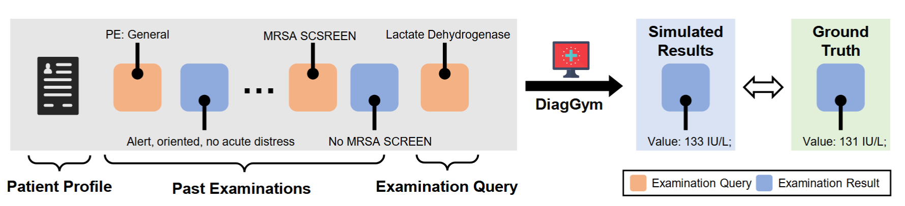

# DiagGym

## 1. Introduction

**DiagGym** is a high‑fidelity **virtual clinical environment** built from real electronic health records (EHRs). It enables **multi‑turn reinforcement learning (RL) training** of large language models (LLMs) for diagnostic reasoning.

In real clinical practice, diagnosis is an iterative decision‑making process: clinicians gather partial evidence, decide which examinations to order, and determine when to commit to a final diagnosis. Most existing LLMs are trained on static, complete patient records, collapsing this process into a single turn and preventing agents from learning to manage full diagnostic trajectories.

DiagGym addresses this by simulating examination results **conditioned** on a patient’s profile, past examinations, and the next examination query. This allows diagnostic agents to interact in a **closed loop**—recommending any examination, receiving realistic results instantly, and adapting their diagnostic plan in real time. This setup is both **safe** (no real patients involved) and **scalable**, enabling the discovery of diagnostic strategies beyond human‑authored trajectories.

---

## 2. Evaluation

### Settings
We evaluate DiagGym on 863 patient cases from MIMIC‑IV, each representing a unique disease and containing an average of 8.77 physical exams, 28.37 lab events, 2.04 microbiology events, and 2.01 radiology events. For each case, the simulator generates examination results sequentially, conditioned on the patient profile, all prior examination results, and the current query. Quality is assessed with **instance‑wise** (case‑level) and **examination‑wise** (test‑level) metrics, covering both **fidelity** (closeness to real data) and **diversity** (distribution coverage), plus computational efficiency.


### Results

| Model              | Min GPUs ↓ | Time (GPU·s) ↓ | Similarity ↑ | Consistency ↑ | Num. Var ↑ | Num. WDist ↓ | LPIPS ↑ | FID ↓ |
|--------------------|------------|----------------|--------------|---------------|------------|--------------|---------|-------|
| **GT**             | -          | -              | -            | -             | **5.31**   | -            | **0.427** | -     |
| DeepSeek‑v3‑671B   | 16         | 62.72          | 2.576        | 88.81         | **24.56**  | 1.336        | 0.237   | 4.158 |
| Qwen2.5‑7B         | **1**      | 0.54           | 2.181        | 81.64         | 20.18      | 9.680        | 0.256   | 4.800 |
| Qwen2.5‑72B        | 4          | 18.68          | 2.495        | 92.39         | 1.21       | 1.839        | 0.183   | 4.901 |
| MedGemma‑27B       | 2          | 9.10           | 2.438        | 89.87         | 18.70      | 16.936       | 0.341   | 4.158 |
| **DiagGym**        | **1**      | **0.52**       | **3.565**    | **96.91**     | 3.46       | **0.128**    | 0.378   | **0.747** |

DiagGym achieves the highest step‑level similarity and full‑chain consistency, the lowest distribution gaps for both numerical and free‑text exams, and runs with the lowest computational cost among strong baselines.

### How to evaluate
Details instruction is comming soon....


## 3. Training
### Data Construction
DiagGym is trained on 114,239 patient EHRs from MIMIC‑IV, reorganized into a patient profile (chief complaint, history, allergies, family history, final diagnosis) and a time‑ordered examination chain. During case filtering, cases without physical exams or with pre‑known diagnoses are excluded. Examination names are standardized using the MIMIC‑CDM mapping, and only pre‑admission exams within 24 hours are included. For detailed data construction pipeline, please refer to our paper.

### Model Training
The DiagGym simulator is **initialized from** [`Qwen2.5-Instruct-7B`](https://huggingface.co/Qwen/Qwen2.5-7B-Instruct) and fine‑tuned to act as a **conditional EHR world model**.

All examination results — whether numerical values (e.g., blood counts) or free‑text reports (e.g., radiology findings) — are **serialized into plain text** and modeled uniformly as a sequence generation task. This allows the simulator to handle heterogeneous medical data within a single unified generative framework.

We frame the task as **autoregressive text generation**:  
given the **patient profile**, the **chronological list of all prior examination results**, and the **name of the next examination**, the model generates the corresponding result token‑by‑token. The training objective is the standard **token‑level negative log‑likelihood (NLL)**.


**Training configuration:**
- **Base model:** Qwen2.5‑Instruct‑7B
- **Objective:** token‑level NLL loss
- **Optimizer:** AdamW
- **Learning rate:** 4×10⁻⁵ with linear warmup
- **Batch size:** 1 per device, gradient accumulation = 8
- **Max sequence length:** 8,192 tokens
- **Epochs:** 15 (converges within this period)
- **Hardware:** 8 × NVIDIA A100 (80GB)

**Training pipeline:**




**How to run training:**

The full training code is in the `train/` directory.  
A ready‑to‑use script is provided:

```bash
bash local_train.sh
```

The trained model can then serve as a **virtual patient environment** for RL‑based diagnostic agent training or for standalone evaluation.

