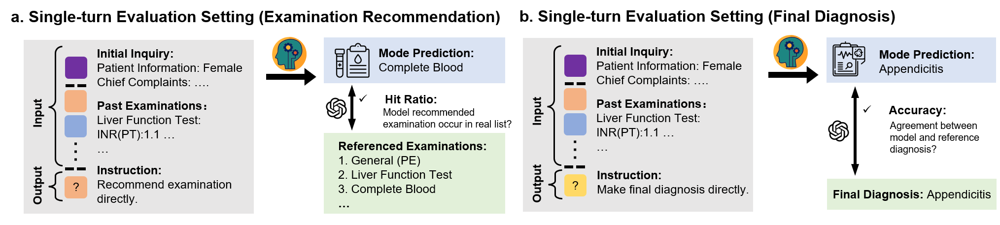
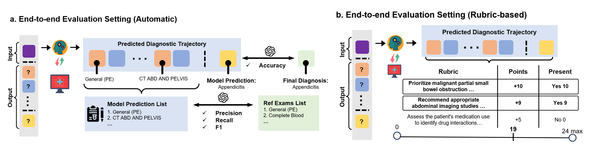

# DiagGym
<div align="center">
  
  <div align="center"></div>
</div>


<p align="center">
          🏥 <a href="https://huggingface.co/Henrychur/DiagGym">DiaGym Model</a>&nbsp&nbsp | &nbsp&nbsp 🤖 <a href="https://huggingface.co/Henrychur/DiagAgent-14B">DiaAgent Model</a>&nbsp&nbsp | &nbsp&nbsp 📑 <a href="http://arxiv.org/abs/2510.24654">Paper</a> 
</p>

We introduce **🏥DiagGym**, the first open‑source virtual clinical environment for training large language models (LLMs) as **diagnostic agents** with reinforcement learning (RL).  
DiagGym simulates realistic, multi‑turn diagnostic workflows by generating examination results conditioned on evolving patient states, enabling safe, closed‑loop training without real‑world risk.

Within DiagGym, we train **🤖DiagAgent**—a family of RL‑optimized diagnostic agents (**7B**, **8B**, **14B**)—to actively manage diagnostic trajectories: selecting the most informative examinations, deciding when to stop, and committing to accurate final diagnoses.  

All models are available on Hugging Face for reproduction and extension.


## 🚀 Key Insights & Contributions

- 🏥 **First Open‑Source Diagnostic RL Gym** – **[DiagGym](https://huggingface.co/Henrychur/DiagGym)**: a high‑fidelity EHR world model that simulates examination outcomes for safe, interactive training and evaluation of diagnostic agents.  
- 🤗 **RL‑Trained Diagnostic Agents** – **[DiagAgent‑7B](https://huggingface.co/Henrychur/DiagAgent-7B)**, **[DiagAgent‑8B](https://huggingface.co/Henrychur/DiagAgent-8B)**, and **[DiagAgent‑14B](https://huggingface.co/Henrychur/DiagAgent-14B)**, trained in DiagGym, surpass 12 SOTA LLMs and prompt‑engineered agents in both single‑turn and end‑to‑end diagnostic tasks.  
-   📊 **Rubric-based Diagnostic Benchmark – [DiagBench](https://huggingface.co/datasets/Henrychur/DiagBench)**: A comprehensive benchmark featuring 750 cases with physician-validated examination trajectories and 99 cases annotated with 973 physician-written rubrics to evaluate the quality of the diagnostic *process*.
-   📂 **Open-sourced Training Datasets**: We introduce and will release the first large-scale datasets for training diagnostic world models (118k EHRs) and RL-based agents (16k interactive trajectories), which will be made publicly available on PhysioNet upon approval.
- 🎯 **Closed‑Loop Learning Advantage** – RL in a realistic simulation yields up to **15.12%** higher diagnostic accuracy and **23.09%** higher examination recommendation F1 compared to the best baseline (including DeepSeek-v3, GPT-OSS-120B, and Claude-4).

 

---

## How to Use
### 🏥DiagGym
The following example shows how to generate examination results using DiagGym.
In this example, we first launch a vLLM server to host the model:
```bash
vllm serve Henrychur/DiagGym --served-model-name DiagGym
```
Then, run the following Python code to query the environment:
```py
import os
from typing import Optional
from openai import OpenAI

# Separator token for concatenating past events
SEP = "<SEP>"
stop_tokens = [SEP, "<endoftext>"]

# API credentials (should be set as environment variables or in a config file)
API_KEY = os.getenv("OPENAI_API_KEY", "None")
API_BASE = os.getenv("OPENAI_API_BASE", "http://localhost:8079/v1")

class DiagGym:
    def __init__(self, model_name_or_path: str, api_key: str = API_KEY, api_base: str = API_BASE) -> None:
        self.model_name_or_path = model_name_or_path
        self.client = OpenAI(api_key=api_key, base_url=api_base)

    def simulate(self, context: str, past_events_list: list, exam_name: str) -> Optional[str]:
        """Generate exam results based on patient context and past events."""
        context += "\nThe following summarizes the results from the patient's medical examination:\n"
        
        if len(past_events_list) == 0:
            input_prompt = context + "Exam name:\n" + exam_name + "\nExam results:\n"
        else:
            past_events_str = [
                f"Exam name:\n{event_name}\nExam results:\n{resp}"
                for (event_name, resp) in past_events_list
            ]
            input_prompt = context + SEP.join(past_events_str) + SEP + "Exam name:\n" + exam_name + "\nExam results:\n"
        
        response = self.client.completions.create(
            model=self.model_name_or_path,
            prompt=input_prompt,
            max_tokens=8192,
            temperature=1.0,
            stop=stop_tokens
        )
        return response.choices[0].text.strip()
```
For each inference, you need to provide:

- Patient context (basic info, history, etc.)
- Past examinations (name + results)
- The examination to request

```py
diaggym = DiagGym("DiagGym")
context = "Name:  ___                  Unit No:   ___\n \nAdmission Date:  ___              Discharge Date:   ___\n \nDate of Birth:  ___             Sex:   F\n \nService: OBSTETRICS/GYNECOLOGY\n \nAllergies: \nAmoxicillin / Penicillins / latex\n \nAttending: ___.\n \nChief Complaint:\nright lower quadrant pain\n \nMajor Surgical or Invasive Procedure:\ndiagnostic laparoscopy\n\n \nHistory of Present Illness:\n___ G3P2 LMP ___, hx of endometriosis, presents to the\nED with RLQ pain. Pt reports pain started yesterday later\nafternoon, she had 1 episode of sudden onset of RLQ nagging \npain,\nthen turned to sharp pain, didn't bother her too much, was able\nto continue her activities, and resolved spontaneously. The pain\nreturned this morning, increased frequency and intensity \ncompared\nto yesterday, sharp/stabbing, intermittent, lasting from 5 to 20\nmins, about ___, localizing to the RLQ area, no other\nassociative symptoms. Pain increased with movements/walking.\nDenies nausea, in fact she is hungry and would like to eat.\nReports regular bowel movements, last one was yesterday. No\ndiarrhea, no constipation. No dysuria. Pt reports this pain is\ndifferent than her endometriosis pain (left side and midline),\nshe has never had this kind of pain in the past. After 2 mg of \nIV\nmorphine x2 in the ED, her pain is down to ___.  She had some\nnausea after the initial dose of Morphine, resolved after \nZofran.\nROS: pain not associated with any events, no recent trauma, no\nfever, no chills, no SOB, no CP, no sick contacts.\n \nPast Medical History:\nOBHx: G3P2, SVD x2, both delivered at about 36 wks, ___ \npregnancy\nwas complicated by PEC s/p magnesium. TAB x1. \n \nGynHx: denies hx of abnormal Pap, fibroids; remote hx of\nchlamydia, hx of LSC surgeries x 2 for endometriosis (last\nsurgery was about ___ yrs ago); has not been sexually active for\nthe past ___ yrs, Implanon placed ___ for treatment of\nendometriosis. \n \nPMH: depression, anxiety\n \nPSH: LSC x2 and fulguration for endometriosis\n \nAll: penicillin, amoxicillin, latex\n \nSocial History:\n___\nFamily History:\nnon-contributory"
past_events_list = [("Anion Gap", "Value: 16; Numeric Value: 16.0; Units: mEq/L; Reference Range: 8.0 - 20.0")] # [("EXAM NAME", "EXAM RESULT")]
exam_name = "CHEST (PORTABLE AP)"
diaggym.simulate(context, past_events_list, exam_name)
```

### 🤖DiagAgent
DiagAgent is an RL-trained large language model for interactive diagnosis.
Unlike conventional medical LLMs that only provide a one-shot answer, DiagAgent can **recommend relevant examinations** and **adaptively update its diagnosis** over multiple dialogue turns, committing to a final decision only when sufficient information is available.

Below is an example of running DiagAgent locally with the ``transformers`` library:
```py
from transformers import AutoTokenizer, AutoModelForCausalLM

class TransformersLocalDiagAgent:
    def __init__(self, model_name_or_path, max_tokens=8192, temperature=0.0) -> None:
        self.tokenizer = AutoTokenizer.from_pretrained(model_name_or_path, trust_remote_code=True)
        self.model = AutoModelForCausalLM.from_pretrained(
            model_name_or_path,
            trust_remote_code=True,
            torch_dtype="auto",
            device_map="auto",
            attn_implementation="flash_attention_2"
        )
        self.max_tokens = max_tokens
        self.temperature = temperature
        self.device = self.model.device

    def diagnose(self, messages):
        """Run multi-turn diagnosis given a list of chat messages."""
        text = self.tokenizer.apply_chat_template(
            messages,
            tokenize=False,
            add_generation_prompt=True
        )
        model_inputs = self.tokenizer([text], return_tensors="pt").to(self.device)

        generated_ids = self.model.generate(
            **model_inputs,
            max_new_tokens=self.max_tokens,
            temperature=self.temperature,
            do_sample=(self.temperature > 0),
            eos_token_id=self.tokenizer.eos_token_id
        )

        # Remove the prompt tokens from the generated output
        generated_ids = [
            output_ids[len(input_ids):] 
            for input_ids, output_ids in zip(model_inputs.input_ids, generated_ids)
        ]
        response = self.tokenizer.batch_decode(generated_ids, skip_special_tokens=True)[0]
        return response.strip().replace("```", "")
```
At inference time, pass a list of dialogue messages to the ``diagnose`` method.
Messages can span **multiple diagnostic turns**.
```py
DIAGNOSE_INSTRUCTION = "You are a medical AI assistant. Help the doctor with diagnosis by analyzing patient information, suggesting relevant tests, and providing a final diagnosis when sufficient information is available.\n\nRESPONSE FORMAT:\n\nIf more information is needed:\n```\nCurrent diagnosis: [your diagnosis according to the information provided]\nBased on the patient's initial presentation, the following investigation(s) should be performed: [one additional test]\nReason: [reason for the test]\n```\n\nIf sufficient information exists for diagnosis:\n```\nThe available information is sufficient to make a diagnosis. \n\nDiagnosis: [Diagnosis result]\nReason: [Diagnosis reason]\n```"
initial_inquiry = "- Patient Information: ___ y/o F\n- Chief Complaint: Early satiety, weight loss, abdominal pain\n- History of Present Illness: The patient reports a 1-month history of weight loss (10 lbs), early satiety, fatigue, and lack of energy. She describes an \"empty\" feeling in her stomach, different from nausea or pain. She had episodes of non-bloody emesis several weeks ago and has since reduced her food and fluid intake. She denies fever, chills, sweats, or changes in bowel movements. She has an intermittent cough but no sputum production, shortness of breath, or hemoptysis.\n- Past Medical History: Asthma, hyperlipidemia, hypertension, osteoarthritis, polymyalgia rheumatica, CAD (NSTEMI with LAD dissection), osteoporosis, right hip replacement, H. pylori, s/p TAH/USO for ?endometrial cancer.\n- Personal History: Not provided.\n- Family History: Father had CAD; mother had asthma. No family history of early MI, arrhythmia, cardiomyopathies, or sudden cardiac death.\n- Allergy History: Lisinopril."
diagagent = TransformersLocalDiagAgent("Henrychur/DiagAgent-14B")
response = diagagent.diagnose([
    {"role": "system", "content": DIAGNOSE_INSTRUCTION},
    {"role": "user", "content": initial_inquiry}
])

print(response)
```


---

## 📈 Evaluation

We evaluate **DiagAgent** on our newly constructed benchmark, **[DiagBench](https://huggingface.co/datasets/Henrychur/DiagBench)**, in two complementary settings:

### Single‑Turn Evaluation 

 

In this setting, the agent is given the patient’s state from an oracle diagnostic trajectory and is forced to make a single decision: either recommend the next examination or provide a final diagnosis. This setup isolates the model's next-step reasoning capabilities. We use two metrics:

- **Hit Ratio**: Measures the relevance of examination recommendations. A "hit" occurs if the agent's suggested test appears in the patient's ground-truth medical record.
- **Diagnosis Accuracy**: Measures the correctness of the final diagnosis when the agent is prompted to conclude the case.

### End-to-End Evaluation

 

Here, the agent engages in a multi-turn interaction with the **DiagGym** environment, starting only with the patient's initial inquiry. It must autonomously decide which examinations to request and when it has gathered enough information to make a final diagnosis. This setting reflects a realistic clinical workflow. The resulting diagnostic trajectories are assessed in two ways:

- **Automatic Metrics**: We compare the agent's entire sequence of recommended exams against the ground-truth trajectory using Precision, Recall, and F1-score. The correctness of the final conclusion is measured by Diagnosis Accuracy.
- **Rubric-Based Evaluation**: On a specialized subset of 99 cases annotated with 973 physician-written rubrics, we use an LLM-as-a-judge (GPT-4o) to evaluate the procedural quality of the diagnosis. This yields a weighted rubric score that assesses alignment with clinical best practices, moving beyond simple outcome accuracy.

For detailed evaluation procedures and scripts, see our **[paper](http://arxiv.org/abs/2510.24654)** and **[evaluation code](/DiagAgent/eval/)**.  
👉 For **DiagGym** evaluation, please refer to the [DiagGym Evaluation](/DiagGym/eval/).

---

### 📊 Main Results

**Single‑Turn Evaluation**

| Model           | Size  | Year   | Hit Ratio | Diagnosis Accuracy |
|-----------------|-------|--------|-----------|--------------------|
| **Basic LLM**   |       |        |           |                    |
| GPT-4o          | -     | 2024.8 | 18.46     | 70.17              |
| Claude-4-sonnet | -     | 2025.5 | 30.62     | 73.25              |
| Qwen2.5         | 72B   | 2024.9 | 17.61     | 72.72              |
| Llama3.3        | 70B   | 2024.12| 18.29     | 64.65              |
| DeepSeek-v3     | 671B  | 2025.3 | 19.14     | 69.64              |
| Qwen3           | 235B  | 2025.7 | 19.82     | 70.81              |
| GPT-OSS         | 120B  | 2025.8 | 16.71     | 66.67              |
| OpenBioLLM      | 70B   | 2024.4 | 22.94     | 64.01              |
| Baichuan-M1     | 14B   | 2025.2 | 18.50     | 77.39              |
| MedGemma        | 27B   | 2025.7 | 27.07     | 68.90              |
| **Agentic System** |    |        |           |                    |
| MedAgents       | -     | 2024.1 | 18.31     | 68.26              |
| MDAgents        | -     | 2024.10| 19.24     | 71.66              |
| **Our Method**  |       |        |           |                    |
| DiagAgent       | 7B    | -      | **71.12** | 85.03              |
| DiagAgent       | 8B    | -      | 54.61     | 81.10              |
| DiagAgent       | 14B   | -      | 67.54     | **86.73**          |


**End‑to‑End Evaluation (Automatic Metrics)**

| Model           | Size  | Year   | Avg. Turns | Precision | Recall | F1     | Accuracy |
|-----------------|-------|--------|------------|-----------|--------|--------|----------|
| **Basic LLM**   |       |        |            |           |        |        |          |
| GPT-4o          | -     | 2024.8 | 3.30       | 29.02     | 14.25  | 19.12  | 41.44    |
| Claude-4-sonnet | -     | 2025.5 | 3.91       | 33.06     | 23.41  | 27.41  | 45.14    |
| Qwen2.5         | 72B   | 2024.9 | 2.47       | 32.67     | 11.09  | 16.56  | 32.66    |
| Llama3.3        | 70B   | 2024.12| 4.25       | 26.53     | 20.52  | 23.14  | 36.79    |
| DeepSeek-v3     | 671B  | 2025.3 | 2.49       | 32.60     | 12.20  | 17.75  | 46.51    |
| Qwen3           | 235B  | 2025.7 | 3.34       | 27.71     | 17.40  | 21.38  | 44.19    |
| GPT-OSS         | 120B  | 2025.8 | 4.08       | 25.94     | 16.16  | 19.92  | 43.02    |
| OpenBioLLM      | 70B   | 2024.4 | 2.59       | 31.94     | 13.75  | 19.22  | 32.88    |
| Baichuan-M1     | 14B   | 2025.2 | 2.30       | 28.82     | 10.98  | 15.90  | 32.35    |
| MedGemma        | 27B   | 2025.7 | 4.10       | 32.50     | 20.04  | 24.80  | 42.39    |
| **Agentic System** |    |        |            |           |        |        |          |
| MedAgents       | -     | 2024.1 | 2.31       | 29.86     | 11.21  | 16.30  | 44.40    |
| MDAgents        | -     | 2024.10| 2.40       | 30.12     | 11.25  | 16.38  | 43.55    |
| **Our Method**  |       |        |            |           |        |        |          |
| DiagAgent       | 7B    | -      | 5.47       | **46.08** | 47.66  | 46.86  | 60.78    |
| DiagAgent       | 8B    | -      | 5.71       | 41.58     | 44.56  | 43.02  | 53.85    |
| DiagAgent       | 14B   | -      | 6.77       | 43.87     | **52.74** | **47.89** | **61.63** |


**End‑to‑End Evaluation (Rubric-based Metrics)**
| Model            | Size | Year   | Rubric Score (%) |
|------------------|------|--------|------------------|
| **Basic LLM**    |      |        |                  |
| GPT-4o           | -    | 2024.8 | 18.02            |
| Claude-4-sonnet  | -    | 2025.5 | 25.84            |
| Qwen2.5          | 72B  | 2024.9 | 15.63            |
| Llama3.3         | 70B  | 2024.12| 16.69            |
| DeepSeek-v3      | -    | -      | 19.07            |
| Qwen3            | 235B | 2025.7 | 24.49            |
| GPT-OSS          | 120B | 2025.8 | 22.26            |
| OpenbioLLM       | 70B  | 2024.4 | 14.11            |
| Baichuan-M1      | 14B  | 2025.2 | 17.43            |
| MedGemma         | 27B  | 2025.7 | 20.72            |
| **Agentic System** |    |        |                  |
| MedAgent         | -    | 2024.1 | 19.49            |
| MDAgent          | -    | 2024.10| 21.64            |
| **Our Method**   |      |        |                  |
| DiagAgent-14B    | 14B  | -      | 32.86            |
---

## Model Training
### 🏥 DiagGym — Virtual Clinical Environment
#### 📂 Data Construction
We build **DiagGym Training Dataset** from the MIMIC‑IV EHR dataset by reorganizing each patient record into:

- **Patient profile** — extracted from discharge notes (physical exam, chief complaint, history, allergies, family/social history, discharge diagnosis)
- **Time‑ordered examination set** — chronologically sorted exams (lab, microbiology, radiology) linked with their results.

The pipeline includes filtering (removing cases without physical exams or with pre‑established diagnoses), standardizing exam names, filling missing labels, and restricting to exams performed within one day before admission to ensure diagnostic relevance.

 

Following the pipeline above, we obtain 118,478 patient EHRs, covering 4,897 distinct diseases.
On average, each case contains 29 examinations (26 laboratory, 2 microbiology, 1 radiology).

> **Note on Data Availability**: The data source for this work is MIMIC-IV. Due to licensing restrictions, we are unable to directly open-source the processed dataset. However, we are actively communicating with the relevant parties regarding the possibility of making the dataset publicly available on [PhysioNet](https://physionet.org/).

#### ⚙️ Training Details
**DiagGym** is trained as a conditional generative "EHR world model" that, given a patient profile and past examinations, generates the result of the next requested examination.
We treat all exam results (textual or numeric) as free text and train with a standard token‑wise autoregressive loss.

 

For full training details and implementation code, see our [paper](http://arxiv.org/abs/2510.24654) and [training scripts](/DiagGym/train/).


### 🤖 DiagAgent — RL‑Trained Diagnostic Agent
#### 📂 Data Construction
As shown in the figure below, we reformat DiagGym cases into **multi‑turn diagnostic trajectories** containing:  
- An **initial inquiry** (structured patient history without the final diagnosis)  
- Iterative steps of *preliminary diagnosis → recommended examination + rationale → exam result*  
- A **final diagnosis** focused on a single primary condition  

All trajectories are generated with DeepSeek‑v3  and filtered to prevent diagnosis leakage.

 

Following this pipeline, we obtain 16,270 interactive diagnostic trajectories

#### ⚙️ Training Details
DiagAgent is optimized with **end‑to‑end multi‑turn reinforcement learning (GRPO)** inside the DiagGym environment.  
In each rollout, the agent starts from an initial inquiry, interacts with DiagGym by recommending examinations and receiving simulated results, and decides when to make the final diagnosis.  

The reward combines three components:  
- **Diagnosis Accuracy** — 1 if the predicted diagnosis matches the ground truth, else 0  
- **Examination Recommendation F1** — overlap between recommended and reference exams from real EHRs  
- **Turn Penalty** — discourages excessive interaction turns beyond the set limit (12)  

 

For full training details and implementation code, see our [paper](http://arxiv.org/abs/2510.24654) and [training scripts](DiagAgent/train/rl/).


## 📝Citation & Contact

'''
@misc{qiu2025evolvingdiagnosticagentsvirtual,
      title={Evolving Diagnostic Agents in a Virtual Clinical Environment}, 
      author={Pengcheng Qiu and Chaoyi Wu and Junwei Liu and Qiaoyu Zheng and Yusheng Liao and Haowen Wang and Yun Yue and Qianrui Fan and Shuai Zhen and Jian Wang and Jinjie Gu and Yanfeng Wang and Ya Zhang and Weidi Xie},
      year={2025},
      eprint={2510.24654},
      archivePrefix={arXiv},
      primaryClass={cs.CL},
      url={https://arxiv.org/abs/2510.24654}, 
}
'''

For any inquiries or feedback, don’t hesitate to contact henrychur@sjtu.edu.cn.
